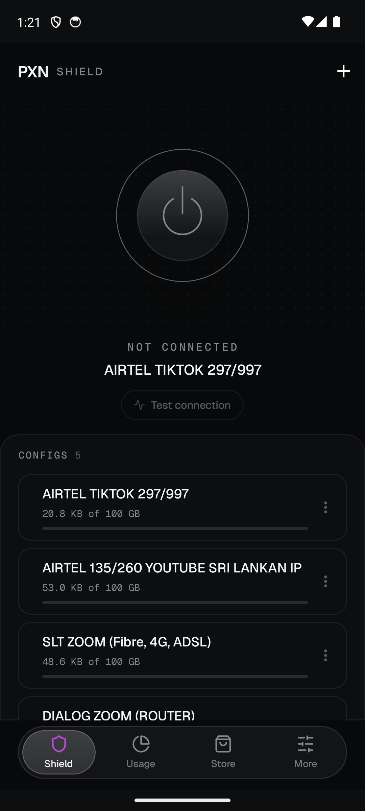
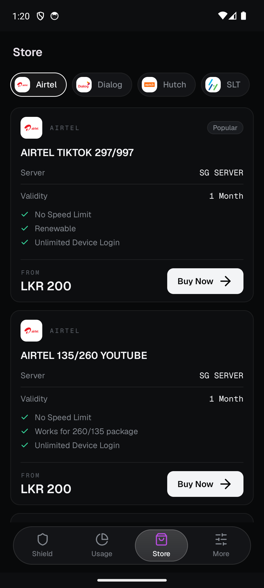
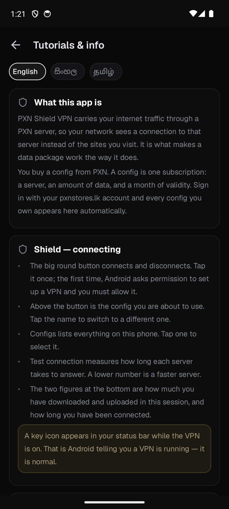

# PXN Shield VPN

The Android client for [PXN Stores LK](https://www.pxnstores.lk). Sign in with the
account you bought your plan on, and the configs you own are already there — no
links to paste, no files to import, no QR codes to scan.

**[Download the latest release →](https://github.com/NightRiderr77/pxn-shield-android/releases/latest)**

  
  
  

---

## What it does

**Your configs arrive with your account.** Sign in with email and password or with
Google, and every active config on your PXN account is pulled down and named after
the product you bought. Buy another plan and it appears on the next sync.

**Buy and renew without leaving the app.** Pick your network, pick a package, pick
how much data, pay, attach the slip. The order lands in your purchase history on
pxnstores.lk exactly as if you had bought it in a browser, and orders still being
processed are listed under the packages until the config arrives. Renewing is on
the config itself and keeps the same server and link.

**A guide in three languages.** **More → Tutorials & info** explains every screen,
the whole ordering process, what the transfer remark is for and what to try when
something is not right — in English, Sinhala or Tamil, whichever you pick.

**You can see what you have left.** Every config shows what it has used against its
allowance and how many days remain, and the account total is on one ring. The
numbers come from the same place your order page reads them from, so the app and
the website never disagree.

**It records what this phone actually moved.** A 7-day and 30-day chart, measured
locally as the tunnel runs. Touch any bar for that day's total and its date. This
one is the phone's own count, not the account's — the label says so.

**Routing you can change from the phone.** Configs that support it can be switched
between a Cloudflare Warp+ route and a Sri Lankan IP without opening the website.
The daily switch allowance is shown before you spend one.

**Per-app split tunnelling.** Choose which apps go through the tunnel and which go
direct.

**A Quick Settings tile.** Connect and disconnect from the notification shade
without opening the app.

**No account, no problem.** You can skip sign-in entirely and add configs by hand
from the clipboard. They stay on the phone and will not follow you to a new one.

## Requirements

- Android 7.0 (API 24) or newer
- A PXN Stores account with an active config, for automatic sync

## Installing

Android does not install APKs from outside the Play Store by default. The first
time, it will ask you to allow your browser or file manager to install apps — that
prompt is the system's, and the permission can be revoked afterwards.

1. Open the [latest release](https://github.com/NightRiderr77/pxn-shield-android/releases/latest).
2. Download the right file:

   | File | Use it if |
   |---|---|
   | `..._arm64-v8a.apk` | You have a phone made in roughly the last eight years. **Start here.** |
   | `..._armeabi-v7a.apk` | Your phone is older, or arm64 refuses to install |
   | `..._universal.apk` | You are not sure. Larger, but works everywhere |

3. Open the downloaded file and confirm the install.
4. On first connect, Android asks permission to set up a VPN. That prompt is the
   system's, and it is how every VPN app on Android works.

Only download from the releases page on this repository. An APK for PXN Shield
from anywhere else was not built by us.

## Updating

The app does not update itself. **About → Check for updates** opens the releases
page here. Installing a newer APK over an older one keeps your configs and your
sign-in.

## Privacy

The app talks to two places: your PXN account, to fetch the configs you own and
their usage, and whichever server you connect to. Browsing is not logged, recorded,
or sent anywhere by the app.

Full policy: [pxnstores.lk/privacy](https://www.pxnstores.lk/privacy)

## Support

- **WhatsApp** — [+94 76 154 6544](https://wa.me/94761546544)
- **Setup guides** — [pxnstores.lk](https://www.pxnstores.lk/v2ray/setup-guides)
- **Bugs and requests** — [open an issue](https://github.com/NightRiderr77/pxn-shield-android/issues)
- **Happy with it?** — [leave a review](https://www.trustpilot.com/evaluate/pxnstores.lk)

## Notes

This repository is the download page for PXN Shield VPN. It carries releases,
screenshots and documentation; the application source is not published here.

The app bundles third-party open-source components. Their licences are listed in
full inside the app under **About → Open Source licenses**.

---

  Built by <a href="https://www.pxnstores.lk">PXN Stores LK</a>, Colombo.

